# 🏗️ Coder-Buddy System Architecture

## 📋 Overview

This diagram explains how your AI development platform works using LangChain, LangGraph, and IONOS AI Model Hub.

```mermaid
graph TD
    %% User Input Layer
    A[👤 User Input] --> B{Input Type?}
    B -->|Template| C[📁 Template Selection]
    B -->|Custom Prompt| D[💬 Custom Description]
    B -->|Interactive| E[🖥️ Interactive Menu]

    %% Complexity Analysis
    C --> F[🧠 Complexity Analyzer]
    D --> F
    E --> F

    F --> G{Project Complexity?}
    G -->|Simple| H[🟢 Fast Models]
    G -->|Medium| I[🟡 Balanced Models]
    G -->|Complex| J[🔴 Powerful Models]

    %% Model Selection
    H --> K[⚡ Llama-3.1-8B<br/>Mistral-Nemo<br/>Llama-3.1-8B]
    I --> L[⚖️ Mistral-Nemo<br/>Llama-3.1-405B<br/>Llama-3.1-8B]
    J --> M[🚀 Mistral-Nemo<br/>Llama-3.1-405B<br/>Mistral-Nemo]

    %% LangGraph Workflow
    K --> N[🔄 LangGraph State Machine]
    L --> N
    M --> N

    %% Three Agent Pipeline
    N --> O[📋 PLANNER AGENT]
    O --> P[🏗️ ARCHITECT AGENT]
    P --> Q[⚡ CODER AGENT]

    %% File Generation
    Q --> R[📁 File Writer Tools]
    R --> S[🌐 Generated Project]

    %% Output
    S --> T[✅ Complete Web Application]
```



## 🔄 Detailed LangGraph Workflow

```mermaid
sequenceDiagram
    participant U as 👤 User
    participant CA as 🧠 Complexity Analyzer
    participant MM as 🤖 Model Manager
    participant LG as 🔄 LangGraph
    participant P as 📋 Planner
    participant A as 🏗️ Architect
    participant C as ⚡ Coder
    participant FS as 📁 File System

    U->>CA: Project Description
    CA->>MM: Request Models for Complexity
    MM->>LG: Initialize State Machine

    Note over LG: State: {"user_prompt": "..."}

    LG->>P: Execute Planner Node
    Note over P: Uses appropriate model<br/>(Fast/Balanced/Powerful)
    P->>P: Generate structured Plan
    P->>LG: Return Plan state

    Note over LG: State: {"user_prompt": "...", "plan": {...}}

    LG->>A: Execute Architect Node
    Note over A: Uses powerful model<br/>for complex reasoning
    A->>A: Create TaskPlan from Plan
    A->>LG: Return TaskPlan state

    Note over LG: State: {..., "task_plan": {...}}

    LG->>C: Execute Coder Node
    Note over C: Iterative file creation

    loop For each implementation step
        C->>FS: Read existing file
        C->>C: Generate code with tools
        C->>FS: Write file content
        C->>LG: Update coder state
    end

    C->>LG: Mark as DONE
    LG->>U: Complete project files
```



## 🤖 Multi-Model Architecture

```mermaid
graph LR
    subgraph "🏢 IONOS AI Model Hub"
        subgraph "⚡ Fast Tier"
            F1[Llama-3.1-8B-Instruct<br/>4K context, temp=0.3]
        end

        subgraph "⚖️ Balanced Tier"
            B1[Mistral-Nemo-Instruct<br/>8K context, temp=0.4]
        end

        subgraph "🚀 Powerful Tier"
            P1[Llama-3.1-405B-Instruct<br/>16K context, temp=0.2]
        end
    end

    subgraph "🎯 Task Assignment"
        subgraph "🟢 Simple Projects"
            SP[Planner: Fast<br/>Architect: Balanced<br/>Coder: Fast]
        end

        subgraph "🟡 Medium Projects"
            MP[Planner: Balanced<br/>Architect: Powerful<br/>Coder: Fast]
        end

        subgraph "🔴 Complex Projects"
            CP[Planner: Balanced<br/>Architect: Powerful<br/>Coder: Balanced]
        end
    end

    F1 --> SP
    B1 --> SP
    B1 --> MP
    P1 --> MP
    B1 --> CP
    P1 --> CP
```



## 🔧 LangChain Integration Points

```mermaid
graph TB
    subgraph "🦜 LangChain Components"
        subgraph "💬 Chat Models"
            CM1[ChatOpenAI<br/>IONOS Endpoint]
            CM2[Structured Output<br/>Pydantic Models]
            CM3[Temperature Control<br/>Token Limits]
        end

        subgraph "🛠️ Tools & Agents"
            T1[write_file]
            T2[read_file]
            T3[list_files]
            T4[get_current_directory]
            RA[ReactAgent<br/>Tool Execution]
        end

        subgraph "📋 Prompt Templates"
            PT1[Planner Prompts]
            PT2[Architect Prompts]
            PT3[Coder Prompts]
        end
    end

    subgraph "🔄 LangGraph State Machine"
        SM[StateGraph Dict]
        N1[Planner Node]
        N2[Architect Node]
        N3[Coder Node]
        CE[Conditional Edges]
    end

    CM1 --> N1
    CM1 --> N2
    CM1 --> N3
    CM2 --> N1
    CM2 --> N2
    PT1 --> N1
    PT2 --> N2
    PT3 --> N3
    T1 --> RA
    T2 --> RA
    T3 --> RA
    T4 --> RA
    RA --> N3

    N1 --> SM
    N2 --> SM
    N3 --> SM
    CE --> SM
```



## 📊 Data Flow & State Management


## 🎯 Key Learning Points

### 1. **LangGraph State Machine**
- Manages state flow between agents
- Each node receives and returns dictionary state
- Conditional edges control workflow direction
- State accumulates data as it flows through nodes

### 2. **LangChain Integration**
- `ChatOpenAI` connects to IONOS endpoint
- `with_structured_output()` ensures consistent data format
- Tools enable agents to interact with file system
- Prompt templates standardize agent instructions

### 3. **Multi-Model Optimization**
- Different models for different cognitive tasks
- Planning needs balanced reasoning
- Architecture needs deep complex thinking
- Coding can often be done with faster models

### 4. **Tool Usage Pattern**
- `ReactAgent` combines LLM with tools
- Tools are Python functions exposed to agents
- Agents reason about when to use tools
- File operations are abstracted through tools

### 5. **State Evolution**
```python
# Initial state
{"user_prompt": "Create a todo app"}

# After Planner
{"user_prompt": "...", "plan": Plan(...)}

# After Architect
{"user_prompt": "...", "plan": Plan(...), "task_plan": TaskPlan(...)}

# During Coder
{"...", "coder_state": CoderState(current_step_idx=0)}
```

This architecture creates a powerful, scalable AI development platform that can handle projects of any complexity! 🚀