# 🤖 Multi-Model Optimization Flow

## 🎯 Decision Tree: How Models Are Selected

```mermaid
flowchart TD
    A[📝 User Input] --> B[🧠 Complexity Analyzer]

    B --> C{Analyze Keywords}
    C --> D[Count Simple Keywords<br/>• single page<br/>• basic<br/>• simple<br/>• minimal]
    C --> E[Count Complex Keywords<br/>• dashboard<br/>• admin panel<br/>• e-commerce<br/>• authentication]
    C --> F[Count Features<br/>• CRUD operations<br/>• real-time<br/>• responsive<br/>• animations]

    D --> G[Simple Score]
    E --> H[Complex Score]
    F --> I[Feature Weight]

    G --> J{Complexity Decision}
    H --> J
    I --> J

    J -->|Score < 3<br/>Simple > Complex| K[🟢 SIMPLE PROJECT]
    J -->|Score 3-8<br/>Balanced indicators| L[🟡 MEDIUM PROJECT]
    J -->|Score > 8<br/>Complex > Simple| M[🔴 COMPLEX PROJECT]

    K --> N[Fast Model Selection]
    L --> O[Balanced Model Selection]
    M --> P[Powerful Model Selection]

    N --> Q[⚡ Planner: Llama-3.1-8B<br/>🏗️ Architect: Mistral-Nemo<br/>⚡ Coder: Llama-3.1-8B]
    O --> R[⚖️ Planner: Mistral-Nemo<br/>🚀 Architect: Llama-405B<br/>⚡ Coder: Llama-3.1-8B]
    P --> S[⚖️ Planner: Mistral-Nemo<br/>🚀 Architect: Llama-405B<br/>⚖️ Coder: Mistral-Nemo]

    Q --> T[2-5 min generation]
    R --> U[5-15 min generation]
    S --> V[15-30 min generation]
```



## 🔍 Complexity Analysis Algorithm

```python
class ProjectAnalyzer:
    COMPLEXITY_INDICATORS = {
        "simple": [
            "single page", "basic", "simple", "minimal", "quick",
            "landing page", "hello world", "display", "show", "static"
        ],
        "complex": [
            "dashboard", "admin panel", "e-commerce", "blog platform",
            "cms", "authentication", "database", "api", "real-time",
            "chat app", "multi-page", "responsive", "animation",
            "interactive", "game"
        ]
    }

    FEATURE_WEIGHTS = {
        "crud": 2,          # Create, Read, Update, Delete
        "database": 2,      # Data persistence
        "authentication": 3, # User management
        "real-time": 3,     # Live updates
        "responsive": 1,    # Mobile support
        "animation": 1,     # Visual effects
        "api": 2,          # External integration
        "charts": 2,       # Data visualization
        "form": 1,         # Input handling
        "validation": 1,   # Data checking
        "search": 1,       # Find functionality
        "filter": 1        # Data filtering
    }
```

## 📊 Model Performance Matrix

```mermaid
graph LR
    subgraph "🎯 Task Types"
        T1[📋 Planning<br/>Project decomposition]
        T2[🏗️ Architecture<br/>Task breakdown]
        T3[⚡ Coding<br/>File generation]
    end

    subgraph "🤖 Model Capabilities"
        subgraph "⚡ Fast Models (8B)"
            F1[✅ Quick responses<br/>✅ Simple logic<br/>❌ Complex reasoning<br/>❌ Deep analysis]
        end

        subgraph "⚖️ Balanced Models (12B-70B)"
            B1[✅ Good reasoning<br/>✅ Code quality<br/>✅ Multi-step logic<br/>⚖️ Speed vs Quality]
        end

        subgraph "🚀 Powerful Models (405B)"
            P1[✅ Deep reasoning<br/>✅ Complex architecture<br/>✅ System design<br/>❌ Slower response]
        end
    end

    T1 -.->|Simple projects| F1
    T1 -.->|Medium/Complex| B1
    T2 -.->|Always| P1
    T3 -.->|Simple/Medium| F1
    T3 -.->|Complex| B1
```



## 🔄 Dynamic Model Switching


## 🎚️ Model Configuration Details

### Temperature Settings by Task
```python
MODEL_CONFIGS = {
    "planning": {
        "temperature": 0.4,  # Moderate creativity for planning
        "reasoning": "Balance structure with innovation"
    },
    "architecture": {
        "temperature": 0.2,  # Low for consistent system design
        "reasoning": "Precise, logical task breakdown"
    },
    "coding": {
        "temperature": 0.3,  # Focused but flexible coding
        "reasoning": "Consistent syntax with problem-solving"
    }
}
```

### Context Window Optimization
```python
CONTEXT_LIMITS = {
    "fast": 4096,     # Sufficient for simple tasks
    "balanced": 8192,  # Good for medium complexity
    "powerful": 16384  # Handles complex system designs
}

# Context allocation strategy:
# - Planner: Uses full context for project understanding
# - Architect: Needs large context for complex system design
# - Coder: Smaller context per task, but iterative
```

## 🚀 Performance Optimization Strategies

### 1. **Parallel Processing** (Future Enhancement)


### 2. **Caching Strategy**
```python
# Model instance caching
class MultiModelManager:
    def __init__(self):
        self._model_cache = {}  # Cache expensive model instances
        self._response_cache = {}  # Cache similar requests

    def get_cached_response(self, prompt_hash, model_tier):
        """Check if we've seen this type of request before"""
        cache_key = f"{model_tier}:{prompt_hash}"
        return self._response_cache.get(cache_key)
```

### 3. **Adaptive Complexity**
```python
def adaptive_complexity_adjustment(initial_complexity, feedback):
    """Adjust complexity based on generation results"""
    if feedback.generation_time > expected_time:
        return "increase_model_power"
    elif feedback.quality_score < threshold:
        return "increase_model_power"
    elif feedback.generation_time < expected_time * 0.5:
        return "decrease_model_power"
    return "maintain_current"
```

## 📈 Real-World Performance Examples

### Simple Project: Landing Page
```
Input: "Create a simple landing page with contact form"
Complexity: SIMPLE (score: 2)
Models: Fast → Balanced → Fast
Time: 3.2 minutes
Quality: ⭐⭐⭐⭐
```

### Medium Project: Todo App
```
Input: "Todo app with add/edit/delete, local storage, dark mode"
Complexity: MEDIUM (score: 5)
Models: Balanced → Powerful → Fast
Time: 8.7 minutes
Quality: ⭐⭐⭐⭐⭐
```

### Complex Project: E-commerce
```
Input: "E-commerce with cart, checkout, user accounts, admin panel"
Complexity: COMPLEX (score: 12)
Models: Balanced → Powerful → Balanced
Time: 23.4 minutes
Quality: ⭐⭐⭐⭐⭐
```

This multi-model approach ensures optimal resource usage while maintaining high-quality output across all project types! 🎯